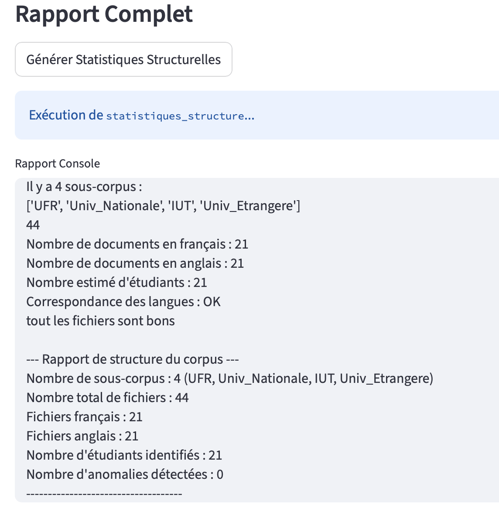
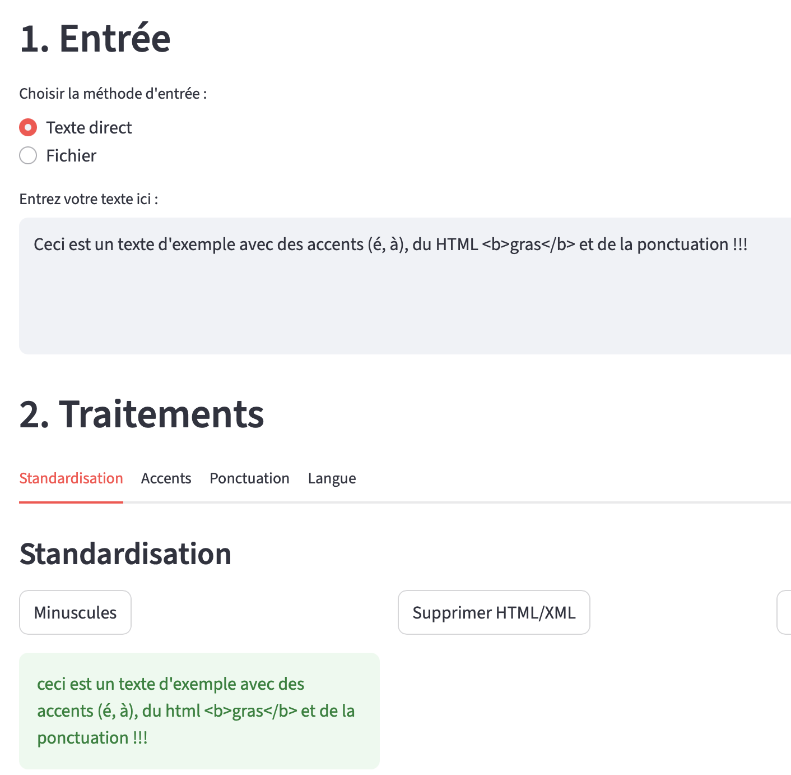
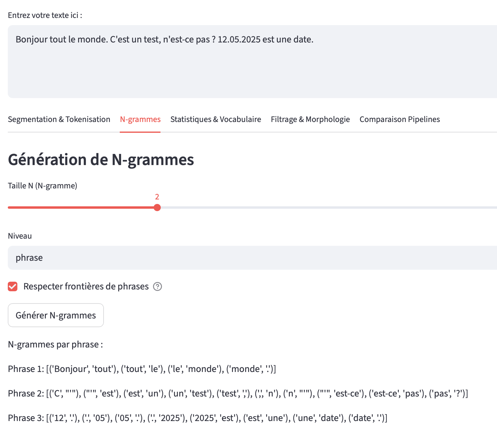
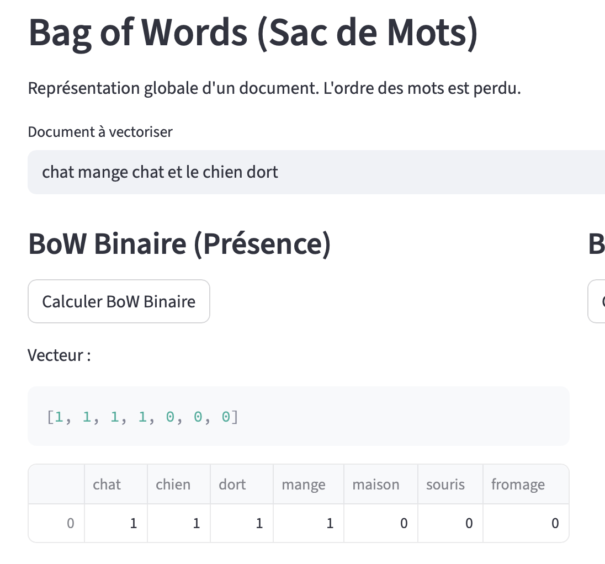
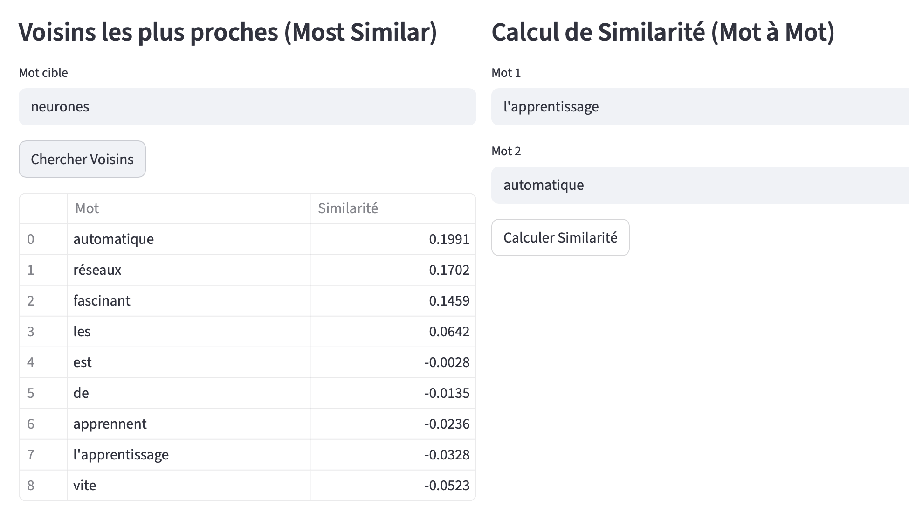
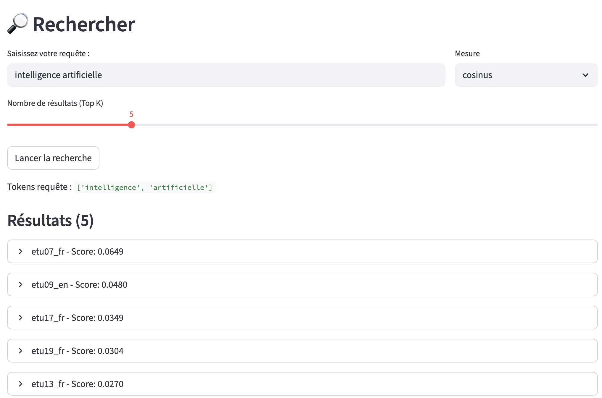

# INFO0708 - Ateliers IA (Master 1 IA)

Ce projet regroupe les TPs. Il inclut une interface graphique fait avec **Streamlit** pour naviguer entre les différents tps et moteur de recherche (Word Embeddings, Traitement de texte, Moteur de recherche, etc.).

## 📋 Prérequis

*   **Python 3.8** ou supérieur installé sur la machine.
*   **Le FrameWork Choisi** **STreamlit**
*   *Pourquoi?* Streamlit est assez intéressant pour transformer les scripts python en app web rapidement . Et il gère les widgets interactifs.

## Supplément (Fonctionnalités supp)
1.  **Persistance des Données (Session State) :** Utilisation de `st.session_state` pour éviter que l'index du moteur de recherche  ou les modèles chargés disparaissent à chaque interaction utilisateur.
2.  **Dynamique :** Dans le moteur de recherche, l'utilisateur peut changer la mesure de distance (Cosinus vs Jaccard) après avoir fait une recherche, sans tout recalculer.

### Si lancement de l'application échoue

[Lien vers l'application web](https://interfac-2lehqrarquaxbhqverno9u.streamlit.app/)


### 1. Installer les dépendances

Installez les librairies nécessaires répertoriées dans le fichier `requirements.txt`.

```bash
pip install -r Interfac/requirements.txt
pip install -r requirements.txt

```

*(Note : Assurez-vous d'être à la racine du projet pour que le chemin soit correct, ou ajustez-le).*

## 2. Lancement de l'application

Pour lancer l'interface principale qui regroupe tous les TP :

1. Assurez-vous d'être à la racine du projet (et que votre environnement virtuel est activé).
2. Exécutez la commande suivante :

```bash
streamlit run Interfac/Accueil.py
```

Votre navigateur par défaut devrait s'ouvrir automatiquement à l'adresse `http://localhost:8501`.

## Contenu 

### TP1 : Traitement de texte et Regex
Introduction aux manipulations de chaînes de caractères et utilisation des expressions régulières pour le nettoyage de texte.

**Fonctionnalités explorées :**
*   Exploration de l'arborescence du corpus (structure, liste fichiers, dossiers).
*   Calcul de statistiques : nombre de documents, répartition par langue (FR/EN), comptage des étudiants.
*   Vérifications de cohérence : extensions de fichiers (.txt), correspondance des paires de documents.

**Paramètres modifiables :**
*   `Chemin du corpus` : Dossier racine contenant les textes à analyser (par défaut "Textes").



### TP2 : Corrections et distances
Calcul de distances entre mots (Levenshtein, Jaccard) et implémentation de correcteurs orthographiques.

**Fonctionnalités explorées :**
*   Standardisation de texte : conversion en minuscules, suppression de balises HTML/XML, normalisation Unicode.
*   Gestion des accents : correction automatique et uniformisation.
*   Traitement de la ponctuation : suppression contextuelle, espacement, normalisation.
*   Détection de langue : basée sur le contenu ou le nom du fichier.

**Paramètres modifiables :**
*   **Entrée** : Saisie directe de texte ou chargement d'un fichier `.txt`.
*   **Options** : Activation de la correction d'erreurs ou l'uniformisation des accents. Choix des caractères de ponctuation à conserver.



### TP3 : Modèles N-grammes
Création et utilisation de modèles de langage basés sur les N-grammes pour la prédiction de texte.

**Fonctionnalités explorées :**
*   Segmentation en phrases et tokenisation (gestion dates, décimaux, sigles).
*   Génération de N-grammes (unigrammes, bigrammes...) au niveau phrase ou document.
*   Analyse statistique (Loi de Zipf, Happax) et pipelines de prétraitement (Stemming, Lemmatisation).

**Paramètres modifiables :**
*   **Langue** : Français ou Anglais.
*   **Segmentation** : Activation de la détection de dates, numéros et sigles.
*   **N-grammes** : Taille N (slider), niveau d'analyse (document vs phrase).
*   **Filtres** : Longueur minimale des mots, seuil d'occurrences, stop-words.



### TP4 : Classification de textes
Algorithmes de classification de textes (Naive Bayes, etc.) pour catégoriser des documents.

**Fonctionnalités explorées :**
*   Démonstration des vectorisations : One-Hot, Bag of Words (BoW), TF-IDF, BM25.
*   Normalisation de vecteurs (L1, L2, MinMax).

**Paramètres modifiables :**
*   **Vocabulaire** : Liste de mots définissant l'espace vectoriel.
*   **Textes** : Zones de saisie pour tester la transformation texte -> vecteur.
*   **Hyperparamètres** : Formule IDF pour TF-IDF, paramètres $k1$ et $b$ pour BM25.



### TP5 : Extraction d'information
Techniques d'extraction d'entités nommées et d'informations structurées.
*(Note: L'interface se concentre ici sur la vectorisation avancée et les distances)*

**Fonctionnalités explorées :**
*   Vectorisation avancée : Phrases vs Documents (concaténation ou agrégation).
*   Calcul de distances et similarités (Euclidienne, Cosinus, manhattan...).

**Paramètres modifiables :**
*   **Vocabulaire** : Liste de mots commune.
*   **Méthodes** : Choix entre TF, BoW, TF-IDF.
*   **Stratégie** : Agrégation par somme, moyenne ou max pour les documents.


### TP6 : Word Embeddings (Word2Vec / FastText)
Exploration des plongements de mots (Word Embeddings) avec Word2Vec et FastText.

**Fonctionnalités explorées :**
*   Entraînement de modèles (Word2Vec, FastText).
*   Exploration sémantique : recherche de voisins proches, analogies, similarité de phrases.
*   Expansion de requêtes pour la recherche d'information.

**Paramètres modifiables :**
*   **Modèle** : Algorithme (Word2Vec vs FastText).
*   **Hyperparamètres** : Dimension des vecteurs, taille de fenêtre, époques.
*   **Données** : Choix entre un corpus jouet ou un texte personnalisé.



### TP7 : Moteur de Recherche Vectoriel
Moteur de recherche performant permettant d'indexer et de rechercher dans le corpus de documents textuels.

**Fonctionnalités explorées :**
*   Indexation complète d'un corpus de documents.
*   Recherche vectorielle avec classement par pertinence.

**Paramètres modifiables :**
*   **Indexation** : Activation du stemming/stopwords, choix de la granularité (Phrase vs Document) et pondération (TF-IDF/TF/BoW).
*   **Recherche** : Requête utilisateur, mesure de similarité (Cosinus, Jaccard...), nombre de résultats (Top K).



